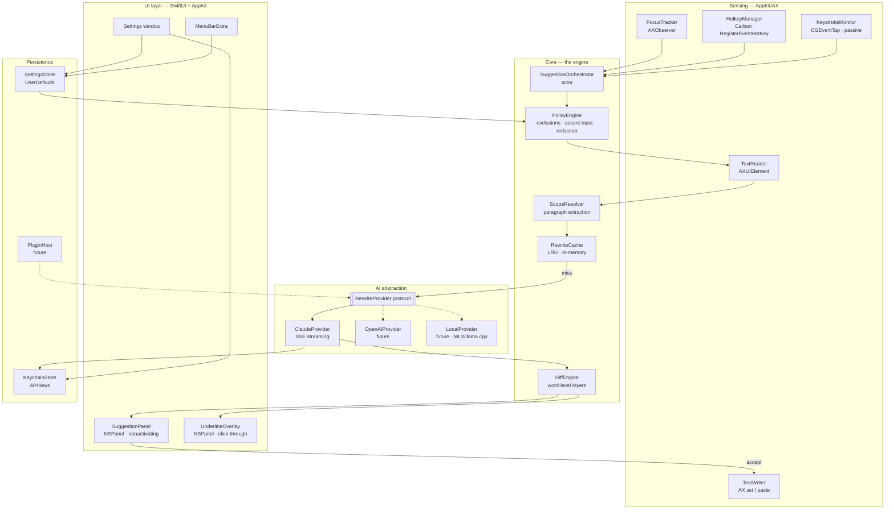
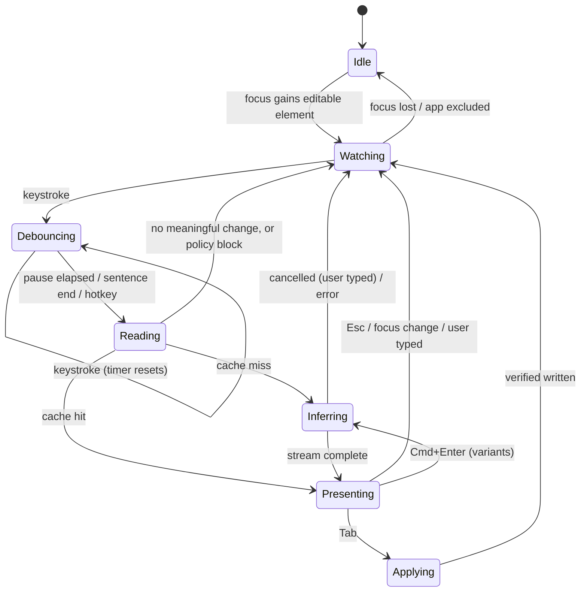
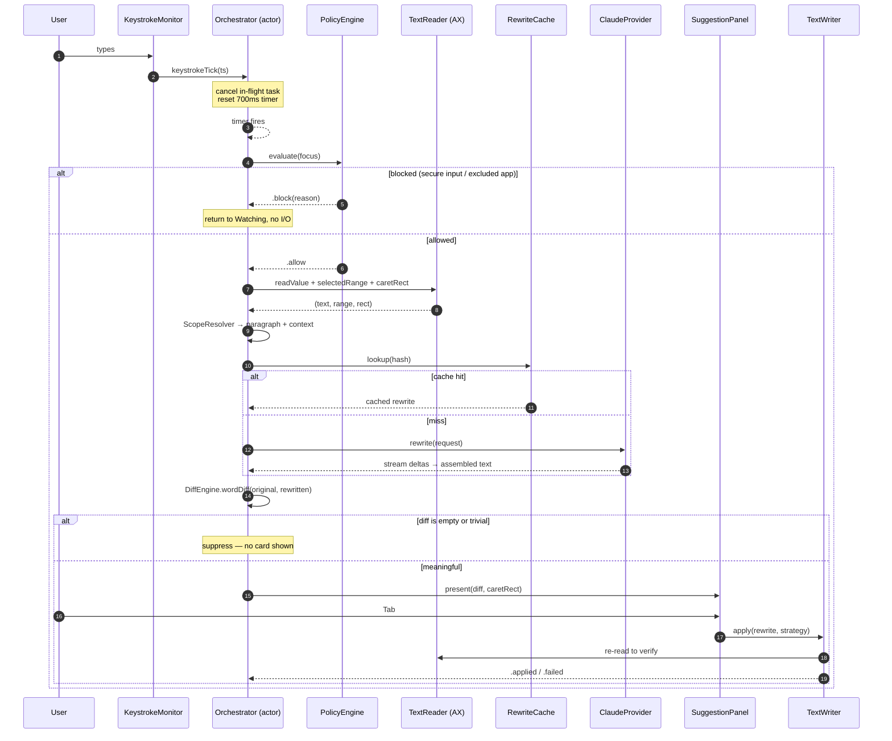
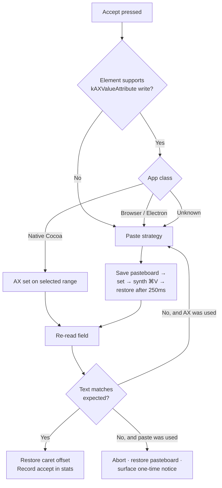

# Architecture

## 1. Process model

One process. Not two.

A common instinct is to split into a UI app plus a privileged background daemon. Resist it for v1: the Accessibility API requires the *calling process* to be AX-trusted, an `NSPanel` overlay must be drawn by a process with a connection to the WindowServer, and a `LaunchAgent` daemon has neither by default. Splitting buys you a second TCC prompt, XPC plumbing, and a harder debugging story for no isolation win, since both halves would need the same permissions anyway.

**Quill is a single `LSUIElement` (agent) app** — `LSUIElement = true` in `Info.plist` gives no Dock icon, no menu bar app menu, but full WindowServer access. Registered as a login item via `SMAppService.mainApp.register()`.

Internally it is layered, and the layers are separated by protocols so that a future split (or a Network Extension for local models) is a refactor, not a rewrite.

## 2. Layer diagram



Solid arrows are v1. Dashed are the extension seams.

## 3. Component breakdown

### 3.1 Sensing

| Component | Responsibility | Key APIs |
|---|---|---|
| `FocusTracker` | Emits `FocusContext` (pid, bundleID, AXUIElement, role, subrole, URL for browsers) whenever the focused element changes | `AXObserver` on `kAXFocusedUIElementChangedNotification`, `NSWorkspace.didActivateApplicationNotification` |
| `TextReader` | Reads value, selected range, caret rect, per-range rects | `AXUIElementCopyAttributeValue`, `kAXBoundsForRangeParameterizedAttribute` |
| `KeystrokeMonitor` | Debounce signal only. **Listen-only tap** — never modifies or consumes events, records no key codes, only a timestamp and a "text-ish keystroke" boolean | `CGEvent.tapCreate(.listenOnly)` |
| `HotkeyManager` | Global shortcuts that work when Quill is not frontmost | Carbon `RegisterEventHotKey` (still the only reliable global hotkey API) |
| `TextWriter` | Applies an accepted rewrite | AX set, or pasteboard + synthetic `⌘V` via `CGEvent` |

`KeystrokeMonitor` is the one piece that alarms security-conscious users, so its contract is narrow by design: it maps every event to `(timestamp, isTextInput: Bool)` and drops the event object immediately. Text content always comes from the Accessibility API, never from the tap.

### 3.2 Core

**`SuggestionOrchestrator`** is a Swift `actor` and owns all mutable session state: current focus, last-read text, in-flight task, debounce timer, pending suggestion. Everything else is stateless or a value type. This makes the concurrency story trivially auditable — there is exactly one place that can race.

State machine:



The critical edge is `Inferring --> Watching` on any keystroke. A suggestion for text the user has since changed is worse than no suggestion, so the in-flight `Task` is cancelled the moment a new keystroke arrives.

**`ScopeResolver`** extracts the paragraph containing the caret plus up to 300 characters of surrounding context (sent as read-only context, explicitly marked "do not rewrite"). This is what keeps request size — and therefore latency and cost — bounded regardless of document length.

**`PolicyEngine`** is a pure function `(FocusContext, String) -> Decision`. Pure means testable, and it means the "did we leak?" question has one answer site.

**`RewriteCache`** keys on `SHA256(normalizedText ‖ toneProfileID ‖ aggressiveness ‖ modelID ‖ promptVersion)`. In-memory `NSCache`, 200 entries, never written to disk. Hit rate in practice is high because users re-trigger on the same paragraph repeatedly while editing around it.

### 3.3 AI abstraction

```swift
protocol RewriteProvider: Sendable {
    var identifier: String { get }
    var capabilities: ProviderCapabilities { get }
    func rewrite(_ request: RewriteRequest) -> AsyncThrowingStream<RewriteEvent, Error>
    func healthCheck() async throws
}

enum RewriteEvent: Sendable {
    case delta(String)          // incremental text
    case variant(index: Int)    // boundary between alternatives
    case usage(TokenUsage)
    case done
}
```

Streaming is modelled as the primitive even though the suggestion card only renders on completion in v1. Reason: for the "Bold" aggressiveness level and for whole-document rewrites the output is long enough that streaming meaningfully improves perceived latency, and retrofitting streaming into a non-streaming interface is painful. See [10-code-snippets.md](10-code-snippets.md) for the SSE implementation.

`ProviderCapabilities` declares `supportsStreaming`, `supportsVariants`, `maxInputTokens`, `requiresNetwork`, `costPerMTokIn/Out`. The orchestrator reads capabilities rather than switching on provider type, so `LocalProvider` (no cost, no network, smaller context) drops in without touching core logic.

## 4. Data flow — the hot path



Steps 5–7 (policy → read) run in under a millisecond. Step 12 is the only unbounded one, and it is the only one that can be cancelled.

## 5. Data flow — replacement strategy selection



The AX-then-paste fallback matters: `kAXValueAttribute` writes report success and do nothing in a large fraction of web content. Verifying by re-read is the only reliable signal.

## 6. Threading model

| Work | Executor |
|---|---|
| `CGEventTap` callback | Dedicated `CFRunLoop` on a high-priority thread. Does one atomic timestamp store and returns. |
| `AXObserver` callbacks | Main run loop (required by the API) |
| AX reads/writes | Main actor — AX is not thread-safe and cross-thread use produces intermittent `kAXErrorCannotComplete` |
| Orchestration, diffing, caching | `SuggestionOrchestrator` actor, background executor |
| Network | `URLSession` async, structured-concurrency child tasks of the orchestrator's task |
| UI | `@MainActor` |

AX calls on the main actor is a real constraint: a slow `AXUIElementCopyAttributeValue` against a hung app will block the main thread. Mitigation is `AXUIElementSetMessagingTimeout(element, 0.25)` on every element Quill touches, plus never reading in a loop.

## 7. Plugin architecture (v2 seam)

Two extension points, both defined in v1 so the shapes don't have to change later:

1. **Providers** — anything conforming to `RewriteProvider`. In-process for built-ins; out-of-process via XPC for third-party, so a crashing plugin cannot take down the agent.
2. **Transforms** — `(RewriteRequest) -> RewriteRequest` and `(RewriteResult) -> RewriteResult` hooks, registered in an ordered chain. This is how "redact company names before sending", "enforce a glossary", or "append a team style guide" get built without forking.

Distribution as signed bundles in `~/Library/Application Support/Quill/Plugins`, validated by code signature before load.
